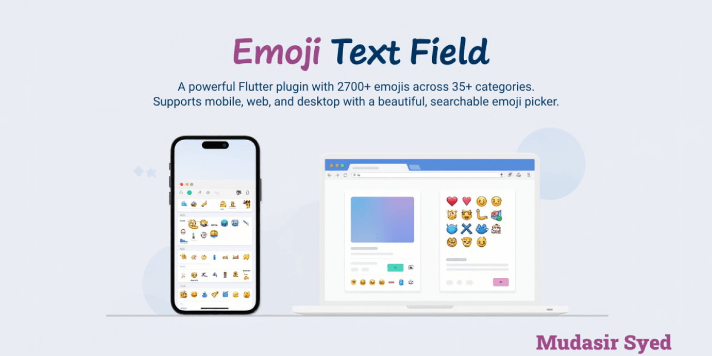
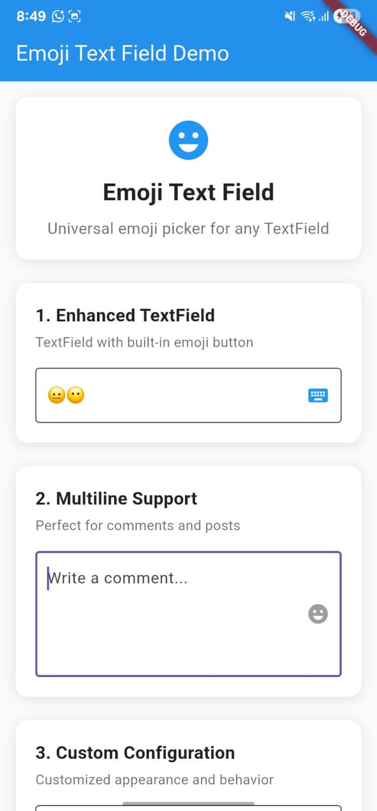
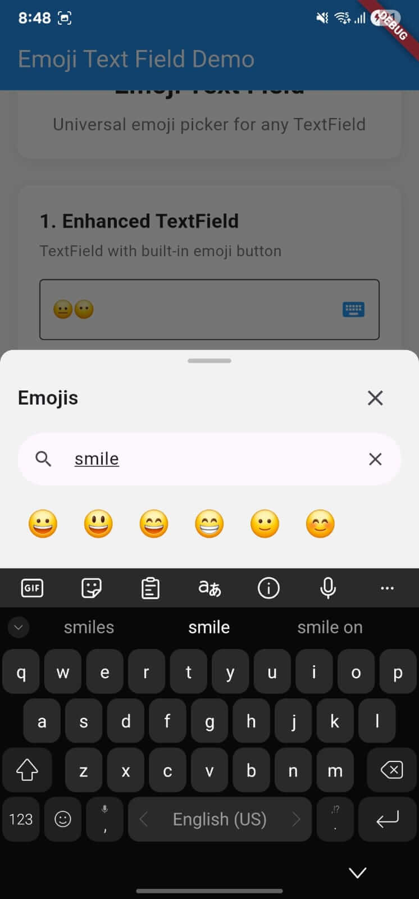
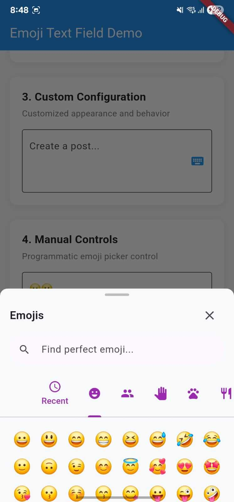
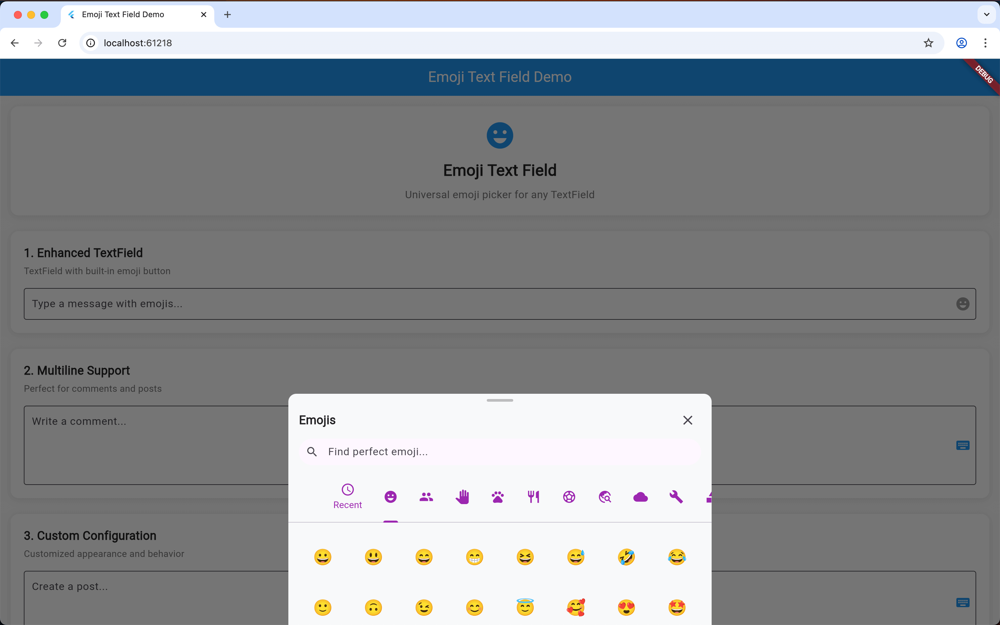

# Emoji Text Field

[](https://pub.dev/packages/emoji_text_field)
[](https://pub.dev/packages/emoji_text_field)
[](https://pub.dev/packages/emoji_text_field)
[](https://pub.dev/packages/emoji_text_field)

A universal emoji picker that works with any TextField in Flutter. Easy to integrate with customizable design and comprehensive emoji support featuring **35+ categories** and **2700+ emojis**.



## ✨ Features

- 🎯 **Universal Compatibility** - Works with any TextField or TextEditingController
- 📱 **Multiple Display Options** - Bottom sheet, overlay, or enhanced TextField
- 🔍 **Smart Search** - Keyword-based emoji search ("happy", "love", "food")
- 📂 **35+ Categories** - Comprehensive emoji organization including Smileys, Animals, Food, Activities, Travel, Weather, Objects, Symbols, Flags, and more
- 🎨 **2700+ Emojis** - Complete Unicode emoji support with latest additions
- ⏰ **Recent Emojis** - Automatically saves recently used emojis
- 🎨 **Fully Customizable** - Colors, sizes, animations, categories, and keywords
- 📳 **Haptic Feedback** - Enhanced user experience with tactile feedback
- 🚀 **High Performance** - Optimized rendering and smooth animations
- 🧪 **Well Tested** - Comprehensive unit and widget tests
- 📖 **Great Documentation** - Clear examples and API documentation

## 📱 Screenshots

### Mobile Demo
<p>



</p>

### Web Demo
<p>

</p>

## 🚀 Quick Start

### Installation

Add this to your package's `pubspec.yaml` file:

```yaml
dependencies:
  emoji_text_field: ^1.0.0
```

Then run:

```bash
flutter pub get
```

### Basic Usage

#### 1. Enhanced TextField (Recommended)

```dart
import 'package:emoji_text_field/emoji_text_field.dart';

EmojiTextField(
  controller: textController,
  hintText: 'Type a message...',
  decoration: const InputDecoration(
    border: OutlineInputBorder(),
  ),
)
```

#### 2. Manual Bottom Sheet

```dart
EmojiTextFieldView.showEmojiKeyboard(
  context: context,
  textController: textController,
);
```

#### 3. Overlay Display

```dart
EmojiTextFieldView.showEmojiOverlay(
  context: context,
  textController: textController,
  textFieldKey: fieldKey,
);
```

## 📚 Advanced Usage

### Custom Configuration

```dart
EmojiTextField(
  controller: textController,
  maxLines: 4,
  emojiConfig: const EmojiViewConfig(
    height: 350,
    backgroundColor: Colors.white,
    indicatorColor: Colors.blue,
    categoryIconColor: Colors.grey,
    columns: 8,
    enableSearch: true,
    showRecentTab: true,
    hapticFeedback: true,
    searchHintText: 'Search emojis...',
  ),
  decoration: const InputDecoration(
    border: OutlineInputBorder(),
    hintText: 'Write something...',
  ),
)
```

### Multiline Support

Perfect for comments, posts, and long-form content:

```dart
EmojiTextField(
  controller: commentController,
  maxLines: 5,
  hintText: 'Write your comment...',
  decoration: const InputDecoration(
    border: OutlineInputBorder(),
    alignLabelWithHint: true,
  ),
)
```

### Integration with Existing TextFields

You can add emoji support to any existing TextField:

```dart
TextField(
  controller: myController,
  decoration: InputDecoration(
    hintText: 'Type here...',
    suffixIcon: IconButton(
      onPressed: () {
        EmojiTextFieldView.showEmojiKeyboard(
          context: context,
          textController: myController,
        );
      },
      icon: const Icon(Icons.emoji_emotions),
    ),
  ),
)
```

### Custom Categories and Keywords

```dart
final customCategories = {
  'favorites': EmojiCategory(
    name: 'My Favorites',
    icon: Icons.star,
    emojis: ['😍', '🔥', '💯', '🎉', '❤️'],
  ),
  // ... more categories
};

final customKeywords = {
  '🔥': ['fire', 'hot', 'lit', 'awesome', 'trending'],
  '💯': ['hundred', 'perfect', 'score', 'complete'],
  // ... more keywords
};

EmojiTextField(
  controller: textController,
  emojiConfig: EmojiViewConfig(
    customCategories: customCategories,
    customKeywords: customKeywords,
  ),
)
```

## 📂 Complete Example

```dart
import 'package:flutter/material.dart';
import 'package:emoji_text_field/emoji_text_field.dart';

void main() {
  runApp(const MyApp());
}

class MyApp extends StatelessWidget {
  const MyApp({super.key});

  @override
  Widget build(BuildContext context) {
    return MaterialApp(
      title: 'Emoji Text Field Demo',
      theme: ThemeData(
        primarySwatch: Colors.blue,
        useMaterial3: true,
      ),
      home: const EmojiTextFieldExample(),
    );
  }
}

class EmojiTextFieldExample extends StatefulWidget {
  const EmojiTextFieldExample({super.key});

  @override
  State<EmojiTextFieldExample> createState() => _EmojiTextFieldExampleState();
}

class _EmojiTextFieldExampleState extends State<EmojiTextFieldExample> {
  final TextEditingController _messageController = TextEditingController();
  final TextEditingController _commentController = TextEditingController();

  @override
  Widget build(BuildContext context) {
    return Scaffold(
      backgroundColor: Colors.grey[50],
      appBar: AppBar(
        title: const Text('Emoji Text Field Demo'),
        backgroundColor: Colors.blue,
        foregroundColor: Colors.white,
      ),
      body: Padding(
        padding: const EdgeInsets.all(16.0),
        child: Column(
          children: [
            // Enhanced TextField
            EmojiTextField(
              controller: _messageController,
              hintText: 'Type a message with emojis...',
              decoration: const InputDecoration(
                border: OutlineInputBorder(),
                filled: true,
                fillColor: Colors.white,
              ),
            ),
            const SizedBox(height: 16),
            
            // Multiline TextField
            EmojiTextField(
              controller: _commentController,
              hintText: 'Write a comment...',
              maxLines: 4,
              decoration: const InputDecoration(
                border: OutlineInputBorder(),
                alignLabelWithHint: true,
                filled: true,
                fillColor: Colors.white,
              ),
            ),
            const SizedBox(height: 24),
            
            // Manual Controls
            Row(
              children: [
                Expanded(
                  child: ElevatedButton.icon(
                    onPressed: () {
                      EmojiTextFieldView.showEmojiKeyboard(
                        context: context,
                        textController: _messageController,
                      );
                    },
                    icon: const Icon(Icons.emoji_emotions),
                    label: const Text('Bottom Sheet'),
                  ),
                ),
                const SizedBox(width: 12),
                Expanded(
                  child: ElevatedButton.icon(
                    onPressed: () {
                      EmojiTextFieldView.showEmojiOverlay(
                        context: context,
                        textController: _commentController,
                        textFieldKey: GlobalKey(),
                      );
                    },
                    icon: const Icon(Icons.layers),
                    label: const Text('Overlay'),
                  ),
                ),
              ],
            ),
          ],
        ),
      ),
    );
  }
}
```

## 🎨 Customization Options

| Property | Type | Default | Description |
|----------|------|---------|-------------|
| `height` | `double` | `300` | Height of emoji picker |
| `backgroundColor` | `Color` | `Color(0xFFF2F2F2)` | Background color |
| `indicatorColor` | `Color` | `Colors.blue` | Tab indicator color |
| `categoryIconColor` | `Color` | `Colors.grey` | Category icon color |
| `emojiTextStyle` | `TextStyle` | `TextStyle(fontSize: 24)` | Emoji text style |
| `columns` | `int` | `7` | Number of emoji columns |
| `showRecentTab` | `bool` | `true` | Show recent emojis tab |
| `maxRecents` | `int` | `28` | Maximum recent emojis |
| `enableSearch` | `bool` | `true` | Enable search functionality |
| `searchHintText` | `String` | `'Search emojis'` | Search placeholder text |
| `hapticFeedback` | `bool` | `true` | Enable haptic feedback |
| `animationDuration` | `Duration` | `Duration(milliseconds: 250)` | Animation duration |

## 📂 Emoji Categories (35+)

The plugin includes comprehensive emoji organization:

- 😀 **Smileys & People** - All face expressions and emotions
- 👋 **Gestures & Body** - Hand gestures and body parts  
- 👥 **People & Professions** - Different people and jobs
- 🐶 **Animals & Nature** - Animals, plants, and nature
- 🍎 **Food & Drink** - All food items and beverages
- ⚽ **Activities & Sports** - Sports, games, and activities
- 🌍 **Travel & Places** - Buildings, transportation, locations
- 🌤️ **Weather & Environment** - Weather conditions and climate
- 📱 **Objects & Tools** - Everyday objects and tools
- ❤️ **Symbols** - Hearts, symbols, and signs
- 🏁 **Flags** - Country and regional flags
- 🏢 **Office & Stationery** - Work and office items
- 💻 **Technology & Devices** - Electronics and gadgets
- 👔 **Clothing & Accessories** - Fashion and accessories
- 🎉 **Celebration & Events** - Party and celebration items
- 💰 **Commerce & Money** - Business and financial symbols
- 🎨 **Culture & Heritage** - Cultural and traditional items
- ❤️ **Love & Relationships** - Romance and relationships
- 🎮 **Gaming & Entertainment** - Games and entertainment
- 🎓 **Education & Learning** - School and education
- ⚠️ **Danger & Warnings** - Safety and warning symbols
- 🏠 **Buildings & Landmarks** - Architecture and landmarks
- 🕌 **Religious & Spiritual** - Religion and spirituality
- 🧬 **Science & Medical** - Science and healthcare
- 🏠 **Home & Household** - Home and domestic items
- 💪 **Health & Wellness** - Health and fitness
- 🔨 **Tools & Construction** - Construction and repair
- 🏆 **Awards & Achievements** - Trophies and recognition
- ⛺ **Outdoors & Adventure** - Outdoor activities
- ❄️ **Cold & Winter** - Winter and cold weather
- ☀️ **Hot & Summer** - Summer and hot weather
- 🧼 **Cleaning & Hygiene** - Cleaning and personal care
- 💼 **Business & Work Life** - Professional and work life

## 🔍 Search Keywords

The emoji picker includes smart search with keywords:

- **Emotions**: happy, sad, love, angry, excited, confused
- **Actions**: wave, clap, thumbs, peace, pray, write
- **Objects**: phone, car, house, food, drink, music
- **Nature**: sun, moon, fire, water, tree, flower
- **Activities**: party, sport, travel, work, study, game

## 📱 Platform Support

| Platform | Support |
|----------|---------|
| Android | ✅ |
| iOS | ✅ |
| Web | ✅ |
| macOS | ✅ |
| Windows | ✅ |
| Linux | ✅ |

## 🤝 Contributing

Contributions are welcome! Please feel free to submit a Pull Request. For major changes, please open an issue first to discuss what you would like to change.

### Development Setup

```bash
git clone https://github.com/mudasir13cs/emoji_text_field.git
cd emoji_text_field
flutter pub get
```

### Running Tests

```bash
flutter test
```

### Running Example

```bash
cd example
flutter pub get
flutter run
```

## 📄 License

This project is licensed under the MIT License - see the [LICENSE](LICENSE) file for details.

## 🙏 Acknowledgments

- Flutter team for the amazing framework
- The Flutter community for inspiration and feedback
- All contributors who help improve this package

## 📞 Support

If you like this package, please give it a ⭐ on [GitHub](https://github.com/mudasir13cs/emoji_text_field) and a 👍 on [pub.dev](https://pub.dev/packages/emoji_text_field).

For issues and feature requests, please use the [GitHub issue tracker](https://github.com/mudasir13cs/emoji_text_field/issues).

